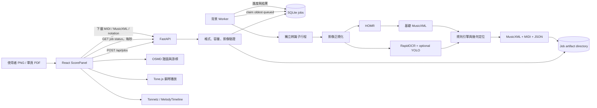
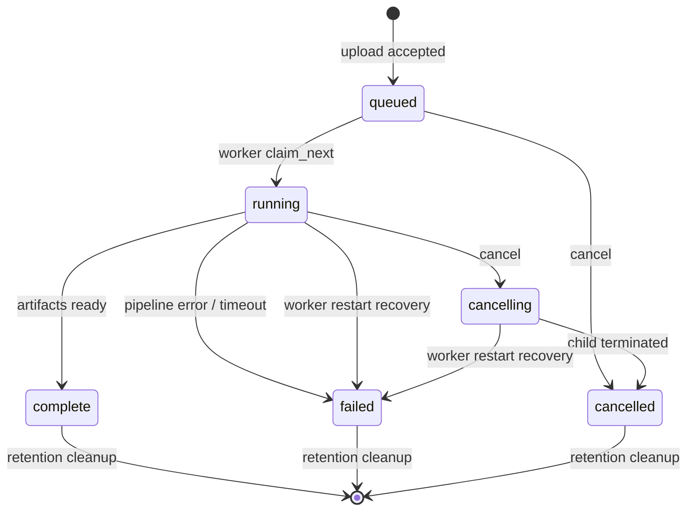
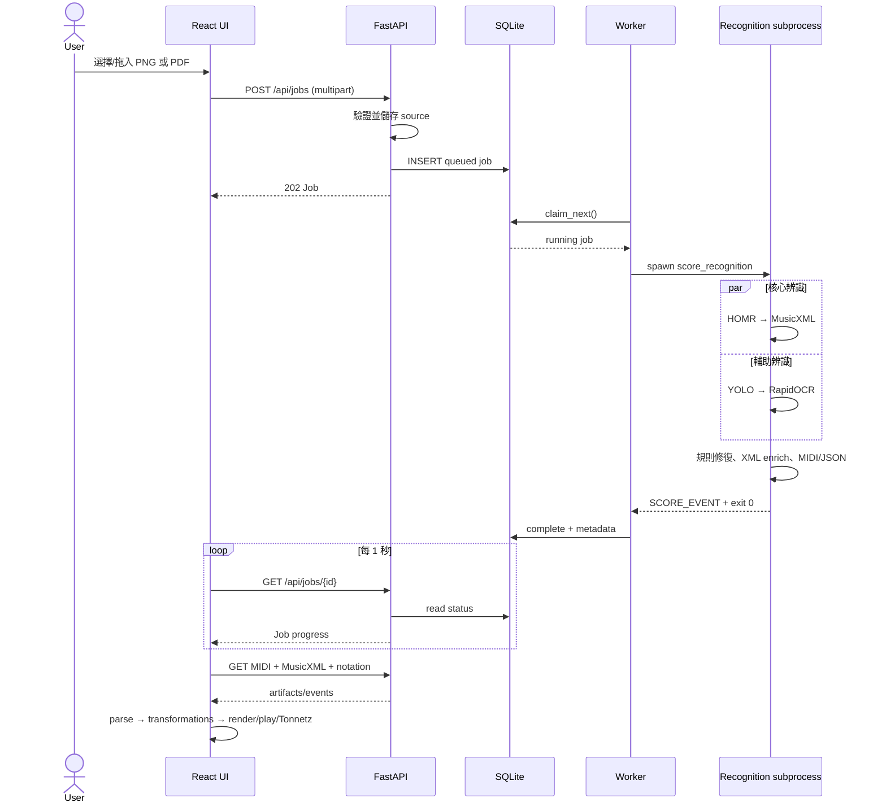

# OnomaRise 樂譜辨識技術架構與前端整合報告

> 文件依據：目前 repository 實際程式碼（2026-09-29）  
> 適用範圍：`python-backend/backend/tonnze` 與 `src/tonntez/score`，以及 Tonnetz 工作區的整合程式

## 1. 系統目標與結論摘要

OnomaRise 的樂譜辨識不是單一模型直接輸出結果，而是一條混合式 OMR（Optical Music Recognition）管線：

1. 接受 PNG 或單頁 PDF。
2. 將輸入正規化成最長邊 3,200～4,000 px、300 DPI 的 RGB PNG。
3. 以 HOMR 辨識音符、節奏、聲部、譜表和 MusicXML 結構。
4. 同步以 RapidOCR 辨識速度、力度、表情與導奏文字；可選擇以 YOLO 偵測延長記號及附點。
5. 用樂理規則修復 MusicXML、將 OCR 座標映射到小節與拍點，產出可渲染、可播放的 MusicXML、MIDI 和語意 JSON。
6. React 前端輪詢背景工作，下載三類結果，再以 OSMD 顯示樂譜、Tone.js 播放，並同步游標、時間軸和 Tonnetz 音高節點。

系統的核心設計是「辨識資料」與「演奏語意」分層：MusicXML 保留譜面結構，MIDI 提供基礎音符，額外的 notation/performance events 在前端依序套用演奏法、裝飾音、速度力度、延長與反覆規則。這可避免為了播放而破壞原始記譜。

## 2. 整體架構



### 2.1 技術棧

| 層級 | 技術 | 用途 |
|---|---|---|
| 前端 | React 19、TypeScript、Vite | 上傳、輪詢、狀態管理與介面 |
| 樂譜渲染 | OpenSheetMusicDisplay 2.1.3 | 將 MusicXML 排成 SVG 五線譜與播放游標 |
| MIDI 解析 | `@tonejs/midi` | 將 MIDI 轉為瀏覽器端音符事件 |
| 音訊播放 | Tone.js + 專案 `AudioEngine` | 排程鋼琴採樣播放 |
| API | FastAPI、Uvicorn | 工作建立、狀態、取消與檔案下載 |
| 工作佇列 | SQLite WAL + 單一 Worker | 持久化工作、FIFO claim、heartbeat、復原與清理 |
| 核心 OMR | HOMR | 影像轉 MusicXML |
| 文字辨識 | RapidOCR / ONNX Runtime | 速度、力度與音樂術語辨識 |
| 符號輔助 | Ultralytics YOLO（可選） | fermata、augmentation dot 候選偵測 |
| 樂譜處理 | music21、ElementTree | 驗證 MusicXML、抽取語意、產生 MIDI |
| PDF/影像 | pypdfium2、Pillow、OpenCV（間接依賴） | PDF rasterize、縮放、譜表與小節線幾何分析 |

## 3. Repository 模組分工

### 3.1 Python 後端

| 檔案 | 職責 |
|---|---|
| `tonnze/main.py` | FastAPI app、CORS、router、整體健康檢查 |
| `tonnze/api/scores.py` | 上傳驗證、工作 API、下載與 notation API |
| `tonnze/repositories/jobs.py` | SQLite schema、原子 claim、狀態轉換、heartbeat、過期清理 |
| `tonnze/worker.py` | 單一背景 worker、子行程生命週期、逾時與取消 |
| `tonnze/services/score_recognition.py` | 編排完整辨識管線並產出 artifacts |
| `tonnze/recognition/homr.py` | HOMR CLI adapter |
| `tonnze/recognition/ocr.py` | RapidOCR 新舊 API 相容、分塊補辨識與去重 |
| `tonnze/recognition/yolo.py` | 640×640 sliding-window inference 與 NMS |
| `tonnze/recognition/geometry.py` | 五線譜系統、雙譜表、小節線定位 |
| `tonnze/rules/*.py` | 術語字典、MusicXML 修復、語意與播放規則 |

### 3.2 React 前端

| 檔案 | 職責 |
|---|---|
| `score/api.ts` | API base、Job 型別、JSON error normalization |
| `score/useScoreImport.ts` | 上傳、每秒輪詢、取消、下載、解析與 UI state |
| `score/ScorePanel.tsx` | 拖放/選檔、進度、錯誤、播放與譜面控制 |
| `score/ScoreNotation.tsx` | OSMD lazy-load、SVG render、cursor 與自動捲動 |
| `score/music.ts` | MIDI 解析、Score domain model、前端驗證與 demo |
| `score/*Timing.ts` | articulation、ornament、performance、fermata 的播放轉換 |
| `score/repeatPlayback.ts` | 反覆、ending、D.C./D.S./Coda/Fine 展開 |
| `score/useScorePlayback.ts` | 播放、暫停、停止、seek、倍速與 rAF 位置更新 |
| `TonnetzWorkspace.tsx` | 串接分數管線、音訊引擎、Tonnetz 與時間軸 |

## 4. 後端完整流程

### 4.1 上傳與輸入驗證

前端與後端都有基本驗證，但後端才是安全邊界。

- 副檔名只接受 `.png`、`.pdf`。
- 上限 20 MiB，採 1 MiB chunk 寫入，超過即回傳 HTTP 413。
- 空檔回傳 HTTP 400。
- PNG 必須真的是 Pillow 判定的 PNG、短邊至少 100 px、總像素不可超過 2,500 萬。
- PDF 必須可讀、未加密且只有一頁；PDFium 操作以 process-local lock 序列化。
- 原始檔儲存在 `score-recognition/data/<job-id>/source.<ext>`。
- 工作 ID 使用 UUID v4，檔名最多保留 200 字元。
- queue 中工作最多 20 筆；滿載回傳 HTTP 429。

驗證成功後建立 `queued` 工作。即使 client 在回應途中斷線，已接受的工作也不會被刪除；驗證失敗時才清除暫存目錄。

### 4.2 SQLite 工作狀態機



資料庫採 WAL、10 秒 busy timeout，工作內容存在 JSON `payload`，並額外把 `status`、`finished_at` 正規化成欄位以利索引與清理。主要特性如下：

- `BEGIN IMMEDIATE` 保證建立、claim、change 的原子性。
- `claim_next` 依 `created_at` 取最舊 queued job，形成 FIFO。
- percent 只能增加，避免平行引擎事件讓進度倒退。
- runtime table 每次 heartbeat 記錄 worker 時間；15 秒內視為存活。
- worker 啟動時把先前 `running/cancelling` 標成中斷失敗。
- terminal job 預設保留 86,400 秒（24 小時），每分鐘清理 DB 與檔案。

### 4.3 Worker 隔離、取消與逾時

worker 本身不直接跑模型，而是為每筆工作建立：

```text
python -u -m tonnze.services.score_recognition <job-directory>
```

子行程 stdout/stderr 寫進 `worker.log`。服務以 `SCORE_EVENT {json}` 行傳送 `percent`、`stage` 或 `error`，worker 每 250 ms 讀取新內容並寫回 SQLite。

- 預設逾時 600 秒。
- 取消時先對 process group 發 SIGTERM，3 秒後仍未退出則 SIGKILL。
- Unix 以 `.worker.lock` + `flock` 避免同一資料目錄同時啟兩個 worker。
- 每一工作用獨立 process，可隔離模型記憶體、原生套件 crash 與取消訊號。
- 目前 Windows 分支沒有 `fcntl` 鎖，而且 `terminate()` 使用 `killpg`；跨平台行為需另行驗證。

### 4.4 影像正規化

`prepare_image()` 將所有輸入轉為 `score.png`：

- PDF：以 PDFium rasterize，scale 不超過 4 倍，且最長邊不超過 4,000 px。
- PNG：轉 RGBA；若最長邊小於 3,200 px，以 Lanczos 放大。
- 最後再限制 4,000×4,000，透明區域鋪白底，轉 RGB，寫入 300 DPI PNG。
- `diagnostics.json` 保留原始尺寸、處理後尺寸、是否放大。

此步驟提升線條與小符號的辨識尺度，但插值無法恢復原圖已丟失的資訊，因此低解析度會附帶 warning。

### 4.5 平行辨識

正規化後使用兩條 thread branch：

1. HOMR branch：主辨識流程，輸出 MusicXML/MXL。
2. Auxiliary branch：先執行可選 YOLO，再執行 RapidOCR。

thread pool 的 `max_workers=2` 使最耗時的 HOMR 與輔助流程重疊；但 OCR 和 YOLO 在同一 branch 中仍是序列執行，避免同時載入多個大型模型造成記憶體尖峰。

#### HOMR adapter

- 複製 `score.png` 到 `<job>/homr/page.png`。
- 在隔離目錄執行 `homr <absolute-image-path>`。
- 即時把 HOMR output 前綴為 `[homr]` 寫入 log。
- 必須剛好取得一個 `.musicxml` 或 `.mxl`，否則整筆工作失敗。
- HOMR 是必要引擎；OCR/YOLO 則是可降級的輔助引擎。

#### RapidOCR adapter

- 相容新版 object/dict output 與舊版 tuple/list output。
- 第一次先跑整頁。
- 若結果少於 16 行，或完全沒有規則引擎認得的音樂術語，追加 8 個重疊 crop：4 個水平 band × 2 個半頁 column。
- crop 座標會映射回全頁。
- 信心門檻為 0.35；文字相同且 box overlap ratio ≥ 0.45 時去重，留下較高信心結果。
- 單字母力度記號另要求 0.7 信心才會進入語意層，以降低正文誤判。

#### YOLO adapter

- 僅在安裝 `ultralytics` 且權重檔存在時預設啟用，也可由環境變數控制。
- 權重預期固定類別：`0 = fermata`、`1 = augmentation_dot`；不符就拒絕執行。
- 灰階頁面切成 640×640 tiles，stride 480，邊緣補白。
- MPS 可用時使用 Apple GPU，否則 CPU；預設 confidence 0.65。
- tile 結果映射回全頁，以同類別 IoU > 0.5 做 NMS。
- 現況只保存為 diagnostics 候選，**不直接改寫 MusicXML 或播放事件**，避免把真實掃描雜訊誤植成符號。因此實際 fermata/dot 仍主要依賴 HOMR/MusicXML。

### 4.6 MusicXML 修復與語意合併

HOMR 結果先複製為 `base.musicxml`。程式刻意不做 music21 write round-trip，因為重寫可能重新編號圓滑線、遺失不完整 slur 的一端，或改變 voice/staff/beam 結構。

#### 記譜結構修復

`apply_notation_rules()` 目前聚焦 slur：

- 依 staff + voice + slur number 配對 start/continue/stop。
- 移除無法配對的端點。
- 跨超過一個 system 且沒有 continuation 的長 slur 視為高風險幻覺並移除。
- 多聲部時以平均音高判斷上下 voice；其次使用 stem direction；最後以音符相對目前 clef 中央線的位置決定 above/below。
- 將修復統計寫入 diagnostics 的 `notation_rules`。

#### OCR 座標到樂譜時間的映射

`geometry.py` 以 OpenCV 做二值化與 morphology：

- 長水平線投影估計每一 system 的上下 staff center。
- 在雙譜表間偵測垂直 barline。
- 將 OCR `(x,y)` 指派到最近 system、小節 slot 與該小節內的水平 fraction。
- tempo/section 或位於上譜表上方的文字放 staff 1 above；位於雙譜表下方則放 staff 2 below。
- 幾何分析失敗時，退回依頁面 x/y 比例平均切 system 與 measure。
- 小節 fraction 不直接變成任意拍點，而會 snap 到該小節最近的既有 note onset；若小節開頭有 clef/key/time，會扣除約 14% 的視覺前置空間。

#### 術語規則字典

規則會合併 HOMR 已有 direction、dynamic、wedge 與 OCR 結果，並避免同一小節同一 canonical term 重複插入。

| 類型 | 目前支援範例 | 後續語意 |
|---|---|---|
| 絕對速度 | Larghissimo、Grave、Largo、Adagio、Andante、Moderato、Allegro、Vivace、Presto 等 | 固定 BPM 24～192 |
| 恢復速度 | a tempo、Tempo primo | 回到初始 BPM |
| 漸變速度 | rit./ritardando/rall.、accelerando/accel.、stringendo | 兩小節線性 ±18% |
| 相對速度 | più mosso、meno mosso | 立即 ×1.12 / ×0.88 |
| 複合表情 | allargando、calando/morendo/smorzando | 同時改變 tempo 與 dynamic |
| 力度 | pppp～ffff、mp、mf、fp、sf、sfz、sfp、rf、rfz | velocity 0.16～1.0 |
| 漸強弱 | cresc.、dim./decresc.、MusicXML wedge | 到下一力度或兩小節 fallback ramp |
| 表情 | dolce、legato、cantabile、espressivo、marcato、risoluto、sostenuto、con brio、rubato | gate 與 velocityDelta |
| 導航/段落 | D.C.、D.S.、Segno、To Coda、Coda、Fine、Trio | MusicXML direction 與前端反覆導航 |

插入 MusicXML 時：dynamic 轉 `<dynamics>` 並加 `<sound dynamics>`，tempo 加 `<sound tempo>`，Coda 轉 `<coda>`，section 轉 `<rehearsal>`，其餘用 `<words>`。同時保留 `source: homr/ocr`、confidence、measure、system、beat offset、placement 與 staff 等追蹤資料。

### 4.7 輸出產物

每一成功 job 目錄的主要產物如下：

| 產物 | 用途 |
|---|---|
| `source.png/pdf` | 原始上傳檔 |
| `score.png` | 正規化後的辨識輸入 |
| `homr/*` | HOMR 隔離輸入與原始輸出 |
| `base.musicxml` | 套用保守記譜修復後、尚未插入 OCR direction 的基礎結果 |
| `result.musicxml` | 最終可渲染 MusicXML |
| `result.mid` | 移除反覆導航、依來源順序輸出的線性 MIDI |
| `result.json` | 前端所需 metadata 與 notation events cache |
| `diagnostics.json` | 引擎狀態、原始 OCR/YOLO、術語、鋼琴結構、規則報告與 warnings |
| `worker.log` | 子行程與 HOMR log |

MIDI 產生前會複製 score，移除左右 repeat barline 與 `RepeatExpression`。反覆邏輯交由前端展開，避免 MIDI 自己展開一次、前端又展開一次。

成功條件至少包含一個辨識音符。系統另計算：

- `note_count`：和弦以 pitches 數量計數。
- 第一個 tempo 的 BPM，缺省 120。
- part/staff/measure count 與是否為 grand staff。
- 警告：非雙譜表、低解析度放大、輔助引擎不可用、YOLO 僅供候選等。

## 5. HTTP API 契約

| Method | Path | 說明 | 成功回應 |
|---|---|---|---|
| GET | `/api/health` | 全系統健康檢查、worker 與 engines/features | JSON |
| GET | `/api/scores/health` | 樂譜辨識健康檢查 | JSON |
| POST | `/api/jobs` | multipart `file` 建立工作 | 202 + Job |
| GET | `/api/jobs/{uuid}` | 查詢工作狀態 | Job |
| POST | `/api/jobs/{uuid}/cancel` | 取消 queued/running 工作 | Job |
| GET | `/api/jobs/{uuid}/files/source` | 預覽原檔 | inline PNG/PDF |
| GET | `/api/jobs/{uuid}/files/midi` | 下載 MIDI | attachment |
| GET | `/api/jobs/{uuid}/files/musicxml` | 下載 MusicXML | attachment |
| GET | `/api/jobs/{uuid}/files/diagnostics` | 下載診斷資料 | attachment JSON |
| GET | `/api/jobs/{uuid}/notation` | 取得演奏/記譜事件 | JSON |

Job 的公開欄位包含 `id`、`filename`、`status`、`percent`、`stage`、各時間戳、`error`、`queue_position`、`expires_at`，完成後還可能包含 `note_count`、`bpm`、`engines`、`terms`、`piano`、`warnings`。內部 `suffix` 不公開。

`/notation` 回應：

```ts
{
  articulations: ArticulationEvent[];
  marks: NotationMark[];       // dot / fermata
  ornaments: OrnamentEvent[];  // grace, trill, mordent, turn, tremolo, arpeggio...
  performance: PerformanceEvent[]; // tempo, dynamic, expression curves
}
```

舊 job 若缺部分 cache，API 會從 `result.musicxml` 補算缺少的類別，具備向後相容能力。

## 6. 前端整合與資料流

### 6.1 上傳、輪詢、取消

`ScorePanel` 支援點選與 drag-and-drop，accept 為 `.png,.pdf`。`useScoreImport` 的流程：

1. 以前端 `validate()` 檢查副檔名、空檔、20 MiB。
2. FormData POST `/api/jobs`。
3. 每 1 秒 GET job status，更新 stage、percent 和 progress bar。
4. unmount 或新上傳會 abort 目前 fetch。
5. 使用者可 POST cancel；`cancelling` 時停用取消按鈕。
6. complete 後平行下載 MIDI 與 MusicXML，再取得 notation JSON。
7. `parseMidi()` 建立統一 Score model；成功後切換 workspace 到 score mode。

目前 polling 沒有 exponential backoff、總等待 timeout 或斷線恢復；瀏覽器 refresh 後也不會由 local storage 恢復 job id。

### 6.2 前端 Score model

每個 MIDI note 會轉成：

```ts
{
  midi, name,
  time, duration, velocity,       // 秒域，供播放
  part,
  startBeat, durationBeats        // 記譜拍域，供規則與 OSMD 同步
}
```

Score 同時保留原始 MIDI bytes、MusicXML、notation events、duration、durationBeats、BPM 與有效 track 數。若無音符或 MIDI duration 非正數，前端直接判為不可播放。

### 6.3 演奏轉換順序

`TonnetzWorkspace` 以 immutable transformation 依序建立播放版本：

```text
raw score
  → withArticulationPlayback
  → withOrnamentPlayback
  → withPerformancePlayback
  → withFermataPlayback
  → withRepeatPlayback
  → useScorePlayback
```

順序有實際意義：

- articulation：依 pitch + beat 套 gate/velocity delta，例如 staccato 0.5、accent +0.12。
- ornament：將 grace、trill、mordent、turn、tremolo、arpeggio 等展開成額外短音；仍保留記譜座標。
- performance：將 tempo step/linear curve 積分成秒，並套用 dynamic curve 與 expression gate。
- fermata：在不改寫原始拍點的情況加入停留時間，建立 source-time mapping。
- repeat：解析第一個 `<part>` 的 measures，展開反覆、ending、D.C./D.S./Coda/Fine；每個 backward repeat 固定播放兩次，刻意忽略 OMR 的 `times`。

這些轉換會同時維護「演奏時間」與「來源記譜時間」，使重複段落、延長記號與變速後仍可把播放位置反算回 OSMD 的 beat。

### 6.4 播放引擎

`useScorePlayback`：

- 第一次播放先啟動/載入 `AudioEngine`。
- 以音符名稱、delay、duration、velocity 排程 attack/release。
- 設 30 ms 起播緩衝，減少剛排程時的截音。
- `requestAnimationFrame` 更新目前秒數。
- pause 保存 offset；seek 先 pause 再移動；倍速調整會重新排程。
- 播放途中從 offset 開始時，已開始但尚未結束的音符以剩餘 duration 播放。
- stop、pause、錯誤或 component cleanup 會取消既有排程，generation id 防止舊 async request 回寫狀態。

### 6.5 五線譜顯示與游標同步

`ScoreNotation` 動態 import OSMD 以降低初始 bundle：

- SVG backend、compact drawing、zoom 0.85、隱藏 title/part name。
- 建立半透明紫色 standard cursor。
- 先遍歷 OSMD iterator，把 `CurrentSourceTimestamp.RealValue × 4` 儲存成 quarter-note beat 陣列。
- 播放時以反算後的 `notationBeat` 找到目標 cursor index；倒退則 reset，再逐步 next。
- cursor 超出可視區時自動垂直捲動。
- ResizeObserver 在容器寬度改變時重 render 並更新 cursor。
- 排版失敗不會阻止播放與 Tonnetz，UI 會顯示降級訊息。

### 6.6 Tonnetz 與時間軸整合

播放版 Score notes 會轉為既有 `MelodyEvent[]`，因此不用建立另一套視覺化架構：

- `scorePitchesAt()` 依目前秒數找出所有 sounding notes，轉成 pitch class。
- Tonnetz 同時亮起當下和弦中的多個音級。
- MelodyTimeline 使用相同展開後事件，點擊事件會 seek 到該音符開始時間。
- 工作區在 audio/score mode 間切換時會停止另一模式，避免兩套播放器重疊。
- 成功載入會向既有 Node/Express API 記錄 `score-identify` 使用進度；此呼叫目前硬編碼 `http://localhost:5000`，與辨識 API base 的設定方式不同。

## 7. 設定、部署與執行

### 7.1 主要環境變數

| 變數 | 預設 | 說明 |
|---|---|---|
| `SCORE_DATA_DIR` | `python-backend/score-recognition/data` | artifact 根目錄 |
| `SCORE_DB_PATH` | `<data>/jobs.sqlite3` | SQLite 路徑 |
| `HOMR_BIN` | Python executable 同目錄的 `homr` | HOMR CLI |
| `YOLO_WEIGHTS` | `python-backend/models/fermata-augmentation-dot.pt` | YOLO 權重 |
| `SCORE_MAX_QUEUE` | `20` | queued job 上限 |
| `JOB_TIMEOUT_SECONDS` | `600` | 單筆辨識逾時 |
| `RETENTION_SECONDS` | `86400` | 完成結果保留秒數 |
| `SCORE_ENABLE_OCR` | `1` | RapidOCR 開關 |
| `SCORE_ENABLE_YOLO` | 依 package + weights 自動判斷 | YOLO 開關 |
| `YOLO_CONFIDENCE` | `0.65` | YOLO confidence threshold |
| `TONNZE_CORS_ORIGINS` | localhost/127.0.0.1:5173 | CORS allowlist |
| `VITE_API_BASE_URL` | 空字串 | 前端 API origin；空值代表 same-origin |

### 7.2 Process topology

本機開發至少包含：

1. Vite frontend。
2. Node/Express 使用者與進度服務（port 5000）。
3. FastAPI/Uvicorn 辨識 API（port 8000）。
4. Python score worker。

`package.json` 的 `python-api`、`python-worker` 目前使用 Windows 路徑 `..\\venv\\Scripts\\python`；README 的 macOS/Linux venv 指令與 npm script 並不一致，跨平台啟動應補分平台 script 或統一用 Python launcher。Vite config 目前也沒有 `/api` proxy，因此本機若前端跑 5173、FastAPI 跑 8000，必須設定 `VITE_API_BASE_URL=http://localhost:8000`；部署時可由 reverse proxy 採 same-origin。

### 7.3 建議正式部署方式

```text
Browser
  └─ HTTPS reverse proxy
       ├─ /                 → static React build
       ├─ /api/jobs*        → FastAPI
       └─ /api/user*        → Node API（或整併 API）

FastAPI + Worker
  ├─ shared SQLite（僅限單機）
  └─ shared artifact volume
```

目前設計適合單機或單一 persistent volume。若要水平擴展，需要把 SQLite queue 換成可跨節點的 job broker/database，把檔案改到 object storage，並以 lease/visibility timeout 取代 local lock。

## 8. 容錯、安全與可觀測性

### 已實作

- 副檔名、內容格式、容量、像素數與 PDF 頁數驗證。
- UUID job directory，下載路徑的 kind 使用 allowlist。
- 回應使用 `X-Content-Type-Options: nosniff` 與 `Cache-Control: no-store`。
- queue 上限、工作逾時、取消、worker heartbeat、中斷復原、24 小時清理。
- OCR/YOLO 可失敗降級，HOMR 失敗才終止核心辨識。
- 每工作 diagnostics、worker log、引擎狀態與 warnings。
- CORS origin allowlist，method/header 限制。

### 主要風險與缺口

1. API 無認證與 job ownership：知道 UUID 即可查詢、取消或下載；正式多人服務需綁定登入使用者。
2. Artifact 與 log 皆為本機明文；尚無加密、遠端儲存或細粒度存取控制。
3. 只依副檔名接受格式，雖有 Pillow/PDFium內容驗證，但可再加 MIME/magic bytes 與 malware scanning。
4. `builtins.open` 被全域覆寫成 UTF-8，是大範圍 side effect，可能影響第三方套件；應局部指定 encoding。
5. Windows worker 的 process-group cancel/lock 需要修正與測試。
6. API 與 worker 共用單一長存活 SQLite connection；單機可行，但多 process/API worker 的連線與鎖策略需重新設計。
7. 無 metrics/tracing；目前只有 log、heartbeat 與 diagnostics，缺 queue latency、成功率、模型耗時與各階段錯誤率。
8. OCR/YOLO 原始資訊可能包含檔案內容衍生資料，diagnostics 的下載權限與保存政策需明確化。

## 9. 已知功能限制

- 僅支援印刷譜導向的 PNG 或單頁 PDF；不支援多頁 PDF、JPEG、HEIC、手機相機自動透視校正或手寫譜。
- OMR 主正確率受 HOMR 限制；模糊、傾斜、陰影、裁切不全、複雜多聲部都可能降低準確度。
- YOLO 偵測目前不影響最終結果，實際價值限於 diagnostics。
- 幾何定位假設接近鋼琴雙譜表；非鋼琴、單譜表或自由排版會退回比例估算。
- OCR 規則是有限的義大利文/英文詞彙表，不是任意音樂語言理解。
- 反覆解析只讀第一個 part 的 measure structure；複雜多聲部若 barline/navigation 不一致可能出錯。
- backward repeat 固定兩遍，不採用 MusicXML `times`。
- tempo/dynamic 的漸變長度與表情演奏參數是產品規則，不是從演奏音訊學得。
- 前端不提供人工校正 MusicXML、OCR term、拍點或小節的介面。
- 成功是「至少有音符且可產出結果」，不等於辨識與原譜完全一致。

## 10. 測試現況與建議驗證策略

目前 repository 具有前端 Vitest：

- `articulationTiming.test.ts`
- `ornamentTiming.test.ts`
- `performanceTiming.test.ts`
- `fermataTiming.test.ts`
- `repeatPlayback.test.ts`
- `scoreTimeline.test.ts`

Python 目前可見的測試主要驗證規則詞彙，例如 `risoluto`、D.C./D.S./Coda 導航與 shared vocabulary。尚未形成完整 API/worker/OMR integration suite。

建議分四層補齊：

1. Unit：OCR output normalization、NMS、geometry、XML enrichment、job transition。
2. Contract：各 API status/error、notation schema、舊 job compatibility。
3. Golden files：固定譜圖對應預期 MusicXML 結構、音符/小節/術語與 diagnostics。
4. End-to-end：啟動 API + worker，上傳、輪詢、取消、逾時、下載、OSMD render 與播放同步。

辨識品質不宜只看 job success rate，建議記錄 note pitch accuracy、onset/duration、measure alignment、symbol F1、term accuracy、MusicXML validity，以及從上傳到完成的 p50/p95 latency。

## 11. 優先改善建議

### P0：可部署性與資料安全

- 將 job 綁定登入使用者並檢查所有 status/cancel/download 權限。
- 統一前端 API base 與 Node/FastAPI route，移除 `localhost:5000` 硬編碼。
- 補跨平台啟動腳本、Windows worker terminate/lock。
- 把全域 UTF-8 `open` monkey patch 改為局部編碼處理。

### P1：品質與可維護性

- 建立 20～50 張授權譜面的 golden dataset 與 regression metrics。
- 讓 YOLO detections 經 geometry + confidence/consistency validation 後，選擇性回寫 fermata/dot。
- 增加 deskew、perspective correction、crop/contrast normalization。
- 將 Job/Notation schema 定義成 Pydantic model，並由 OpenAPI 產生 TypeScript types，避免前後端漂移。
- 對每個 pipeline stage 計時，加入 structured logging 與 metrics。

### P2：產品能力

- 多頁 PDF 拆頁、逐頁辨識、合併 score。
- 提供人工校正：音高、節奏、力度、速度、反覆、小節線與 OCR 位置。
- job refresh recovery、SSE/WebSocket progress，取代固定 1 秒 polling。
- 將 artifact 移到 object storage，queue 移到具 lease 的外部服務以支援水平擴展。

## 12. 核心時序總覽



## 13. 一句話交接

若要修改「辨識到了什麼」，從 `recognition/`、`rules/`、`score_recognition.py` 下手；若要修改「辨識結果怎麼顯示與演奏」，從 `src/tonntez/score/*` 下手；若要修改「辨識內容如何映射到 Tonnetz」，入口在 `TonnetzWorkspace.tsx`。

